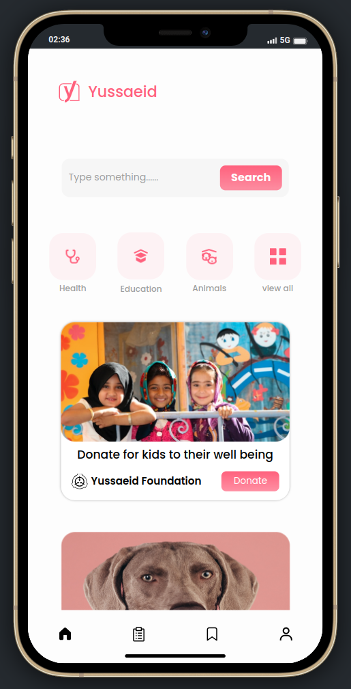
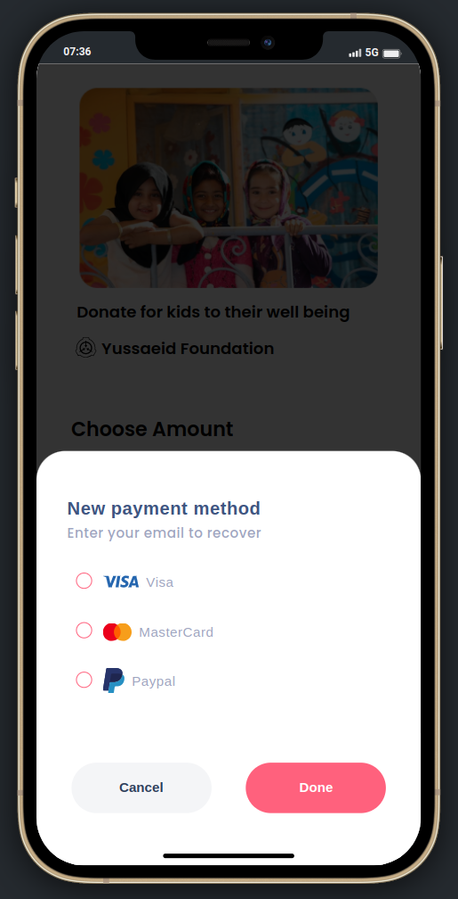

#  <span color="#FF617D">Yussaeid</span>

<p>Um pequeno projecto escolar que tem como finalidade de ajudar Centros de Refugiados e Orfanatos.</p>

<p>A Yussaeid possibilita as pessoas que desejam fazer uma doação em dinheiro e sem sair do conforto de sua casa</p>

## Uma previa do Yussaeid
###  Yussaeid




<!-- 
 -->

<br />

# 💻 Iniciar o Projecto 

Baixa o projecto utilizando o `git` se não tens ele instalado, instala usando o seginte comando.

```shell
    sudo apt-get install git
```

Para quem é usuário Windows pode baixar e instalar o `git` manualmente.

Git para Windows : https://git-scm.com/downloads

Depois de instalar o `git` abra o terminal e rode o camando

```shell
    git clone https://github.com/MauricioMbala02/yussaeid.git
    cd yussaeid
```

O front-end do projecto está a ser desenvolvido com React e TypeScript `React.tsx`

Para iniciar o projecto na sua máquina primeiramente você deve ter o node.js instalado, se não tiver podes fazer o Download e instalar.

Node.js : https://nodejs.org/en

Depois de instalar o node.js em sua máquina abra o terminal ou o cmd no directório do projecto e rode os segintes comandos.

```shell
    npm install
```

Instalando as dependências do Projecto

```shell
    npm i react-router-dom react-icons styled-components
```

Depois de instalar todas as dependências rode o camando

```shell
    npm run dev
```

E o projecto já está iniciado, caso o teu navegador não abra uma aba com o projecto iniciado, vais ter que abrir manualmente, abra uma aba e acesse o http://localhost:5173/ 

Instale a extenção do Google Chrome para o projecto ficar mais fácil de ser visualizado, e ative ela na aba do projecto.

Mobile First: https://chrome.google.com/webstore/detail/mobile-simulator-responsi/ckejmhbmlajgoklhgbapkiccekfoccmk

<br />
<h1>Turma ID 🆔😜</h1>

### Maurício Mbala | https://github.com/MauricioMbala02/
